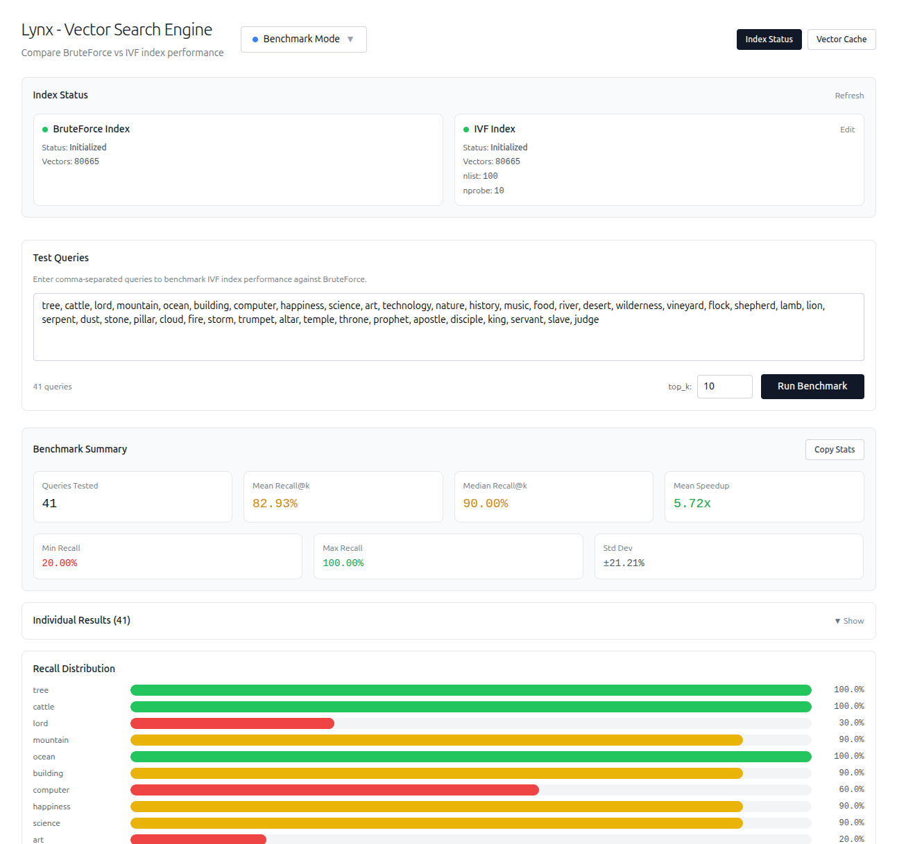

# Lynx - Vector Search Engine

A prototype vector search engine with support for multiple indexing algorithms. This project implements core vector search functionality with a shared index architecture where vectors are viewed by indexes rather than owned by them.

> **Note:** This is a prototype version focused on core algorithms and vector engine business logic. No application layer has been implemented yet.


## Overview

This is an experimental vector search engine built to explore different indexing and search algorithms. The current implementation includes:

- **Brute Force**: Baseline exhaustive search for accuracy comparison
- **IVF (Inverted File Index)**: Efficient approximate nearest neighbor search using clustering
- **IVF-PQ (Inverted File Index with Product Quantization)**: Memory-efficient variant of IVF that compresses vectors using product quantization for reduced memory footprint

## Current Status

🚧 **Prototype Phase** 🚧

Currently implemented:
- Brute force search (baseline)
- IVF indexing algorithm
- IVF-PQ indexing algorithm (IVF with Product Quantization)
- Benchmarking tools for performance analysis and parameter optimization
- Core vector storage and retrieval
- Shared index architecture

Not yet implemented:
- Application layer
- Additional indexing algorithms (e.g., HNSW)
- Performance optimizations
- More optimized embedding pipelines and embedding storage

## Prerequisites

- Docker
- Docker Compose

## Getting Started

### Running the Project

```bash
# Build and start all services
docker compose up

# Or if you need to rebuild
docker compose build
docker compose up
```

### Stopping the Project

```bash
# Stop all services
docker compose down

# Stop and remove volumes
docker compose down -v
```

### Saving/Loading Database State

```bash
# To backup the database state to a file
docker compose exec postgres pg_dump -U lynx lynx > backup.sql

# To restore the database state from a file
docker compose exec -T postgres psql -U lynx lynx < backup.sql
```


> **Note:** Currently only .txt files are supported for the file upload

## Algorithms

### Brute Force
Exhaustive search comparing query vectors against all stored vectors. Used as a baseline for accuracy comparison and for small datasets.

### IVF (Inverted File Index)
Clusters vectors into partitions (Voronoi cells) for efficient approximate nearest neighbor search. Queries only search relevant partitions, significantly reducing search space.

### IVF-PQ (Inverted File Index with Product Quantization)
Combines IVF clustering with product quantization for memory-efficient vector search. Vectors are compressed using learned codebooks while maintaining search accuracy, making it suitable for large-scale deployments with memory constraints.

## Benchmarking

The engine includes comprehensive benchmarking tools to evaluate and optimize algorithm performance:

### Performance Benchmarking
- **Recall Analysis**: Compare approximate search results against ground truth (brute force)
- **Latency Measurement**: Measure search time performance across different algorithms
- **Speedup Calculation**: Quantify performance improvements over baseline methods

### IVF Parameter Optimization
- **Parameter Sweep**: Automated testing of different `nlist` (number of clusters) and `nprobe` (clusters to search) combinations
- **Multi-dimensional Analysis**: Evaluate trade-offs between recall, latency, and memory usage
- **Smart Recommendations**: Algorithm suggests optimal parameter combinations based on:
  - **Best Speedup**: Maximum performance improvement
  - **Best Recall**: Highest search accuracy 
  - **Best Latency**: Fastest search times
  - **Balanced**: Optimal trade-off between recall and speed using elbow curve analysis




## Architecture

The engine uses a shared index model where:
- Vectors are stored independently
- Multiple indexes can reference the same vectors
- Indexes provide different search strategies over the same data
