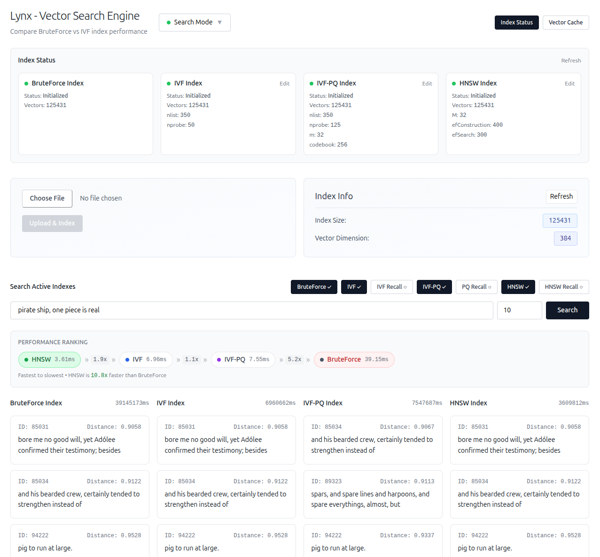
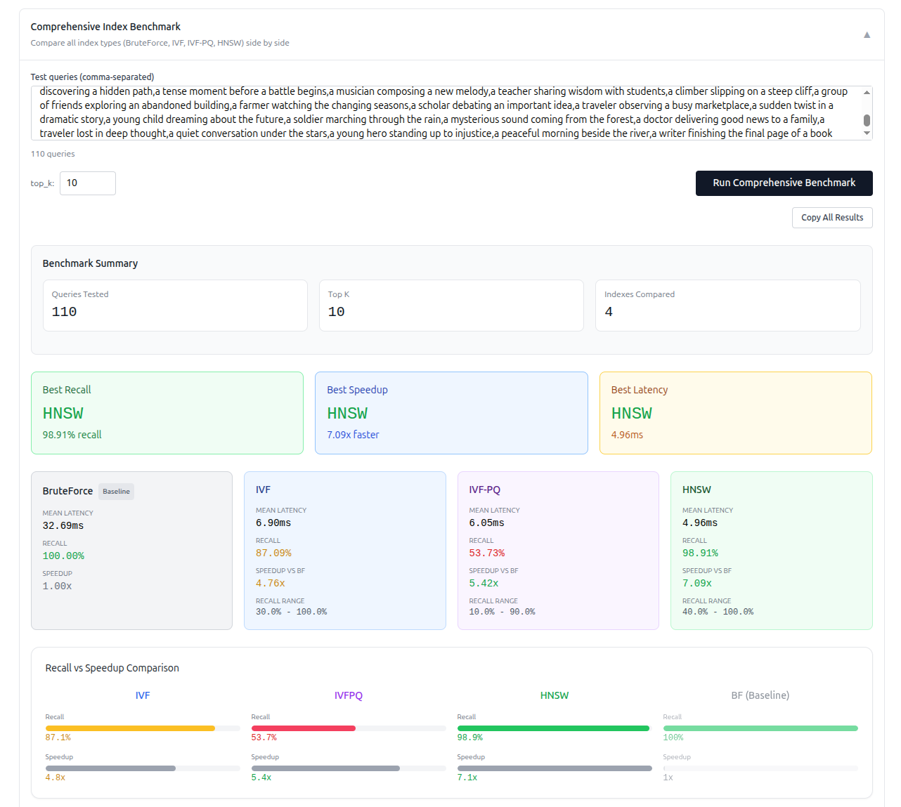
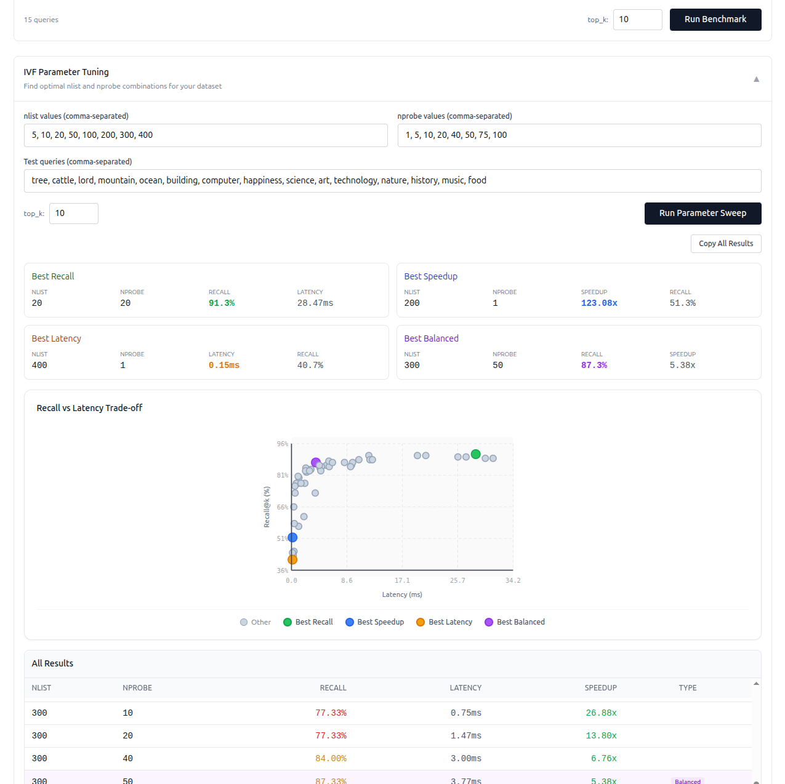

# Lynx - Vector Search Engine

A vector search engine built from scratch in C++ with Go bindings, Python-based embeddings, and a full React UI for search, benchmarking, and operational control.

Lynx is designed around a shared index architecture: vectors live in a central store, and multiple index types (Brute Force, IVF, IVF-PQ, HNSW) reference the same data for different accuracy/latency tradeoffs.



## Overview

Lynx is an applied systems project focused on ANN indexing tradeoffs, index orchestration, and measurable performance. It includes:

- **Brute Force**: Baseline exhaustive search for accuracy comparison
- **IVF (Inverted File Index)**: Efficient approximate nearest neighbor search using clustering
- **IVF-PQ (Inverted File Index with Product Quantization)**: Memory-efficient variant of IVF that compresses vectors using product quantization for reduced memory footprint
- **HNSW (Hierarchical Navigable Small World Graphs)**: Graph-based ANN search for high recall and low latency
- **Master Control Terminal**: Operational UI for index activity, job management, database status, and vector store hot swap

## Current Scope

Implemented:
- Brute force search (baseline)
- IVF indexing algorithm
- IVF-PQ indexing algorithm (IVF with Product Quantization)
- HNSW indexing algorithm (Hierarchical Navigable Small World Graphs)
- Benchmarking tools for performance analysis and parameter optimization
- Core vector storage and retrieval
- Shared index architecture
- Go API layer for search, indexing, status, and admin operations
- React frontend for search workflows and operational monitoring
- Geo ingestion/search path with WebSocket job updates

In progress:
- Additional production hardening and deployment ergonomics
- Further optimization of embedding and indexing workflows

## Prerequisites

- Docker
- Docker Compose

## Getting Started

### Running the Project

```bash
# Build and start all services
docker compose up

# Or if you need to rebuild
docker compose build
docker compose up
```

> **Note:** The geo database image is built locally to include `pgvector`. If you already ran `docker compose up` before this change, rebuild the geo service with `docker compose up --build` (or `docker compose build postgres_geo`).

> **Note:** The API bootstraps the geo schema (`places` table and extensions) on startup. If you created the geo volume before the init scripts existed or changed them, remove volumes (`docker compose down -v`) to reinitialize from SQL.

### Stopping the Project

```bash
# Stop all services
docker compose down

# Stop and remove volumes
docker compose down -v
```

### Saving/Loading Database State

```bash
# To backup the database state to a file
docker compose exec postgres pg_dump -U lynx lynx > backup.sql

# To restore the database state from a file
docker compose exec -T postgres psql -U lynx lynx < backup.sql
```


> **Note:** Currently only .txt files are supported for the file upload, and it is ingested row by row.

## Algorithms

### Brute Force
Exhaustive search comparing query vectors against all stored vectors. Used as a baseline for accuracy comparison and for small datasets.

### IVF (Inverted File Index)
Clusters vectors into partitions (Voronoi cells) for efficient approximate nearest neighbor search. Queries only search relevant partitions, significantly reducing search space.

### IVF-PQ (Inverted File Index with Product Quantization)
Combines IVF clustering with product quantization for memory-efficient vector search. Vectors are compressed using learned codebooks while maintaining search accuracy, making it suitable for large-scale deployments with memory constraints.

### HNSW (Hierarchical Navigable Small World Graphs)
A graph-based indexing algorithm that builds a multi-layer navigable small world graph for efficient approximate nearest neighbor search. HNSW provides high recall and low latency, making it suitable for large datasets and high-dimensional vector spaces.

## Benchmarking

The engine includes powerful benchmarking tools to evaluate and optimize algorithm performance across all indexing methods.

### Comprehensive Cross-Index Benchmarking
The comprehensive benchmark compares **all four indexing algorithms** (BruteForce, IVF, IVF-PQ, and HNSW) using the same queries, providing detailed performance metrics for each:

- **Multi-Index Comparison**: Run identical queries across all indexes simultaneously
- **Statistical Analysis**: Mean, median, min, max, and standard deviation for recall and latency
- **Per-Index Summaries**: Detailed breakdowns of recall, latency, and speedup for each algorithm
- **Decision Support**: Make data-driven choices for index selection based on your specific requirements
  - High recall needed? → Compare HNSW vs IVF metrics
  - Maximum speed required? → Compare IVF-PQ vs IVF speedup
  - Balanced performance? → Analyze recall-latency tradeoffs across all indexes

> **Note**: The following benchmark is from a dataset of 125k 384-dimensional vectors.



### Algorithm-Specific Parameter Optimization

#### IVF Parameter Sweep
- **Parameter Sweep**: Automated testing of different `nlist` (number of clusters) and `nprobe` (clusters to search) combinations
- **Multi-dimensional Analysis**: Evaluate trade-offs between recall, latency, and memory usage
- **Smart Recommendations**: Algorithm suggests optimal parameter combinations based on:
  - **Best Speedup**: Maximum performance improvement
  - **Best Recall**: Highest search accuracy 
  - **Best Latency**: Fastest search times
  - **Balanced**: Optimal trade-off between recall and speed using elbow curve analysis



#### IVF-PQ Parameter Sweep
- **Extended Parameter Space**: Test combinations of `nlist`, `nprobe`, `m` (subquantizers), and `codebook_size`
- **Compression Analysis**: Understand the impact of product quantization parameters on recall and memory
- **Production Optimization**: Find the sweet spot between memory efficiency and search quality

## Architecture

```text
Data Sources -> Embedding Service (Python)
                 |
                 v
            Go API Layer (orchestration, job control, status)
                 |
        +--------+---------+
        |                  |
        v                  v
  C++ Core via Go Bindings   Postgres Stores (vector + geo)
  (BruteForce/IVF/IVF-PQ/HNSW)
        |
        v
   Search + Benchmark Endpoints -> React Frontend (UI + Master Control Terminal)
```

The engine uses a shared index model where vectors are stored independently and multiple indexes reference the same vectors.

## Why I Built This

I built Lynx to deeply understand vector search system design beyond library usage: how index structures behave under different constraints, how API and storage choices affect operability, and how to make algorithm selection data-driven with benchmarking.

The core decisions were:
- Build indexing logic in C++ for performance and control.
- Expose it through Go bindings and APIs for pragmatic service integration.
- Keep embeddings as a separate Python service to isolate model/runtime concerns.
- Add a React operations UI so system behavior is visible, testable, and debuggable in real workflows.

## What I Learned

- A shared vector store across multiple indexes simplifies comparisons and operational consistency.
- Benchmark tooling is essential; index choice is workload-dependent, not one-size-fits-all.
- Operational visibility (job states, readiness, counts, hot-swap controls) matters as much as raw search speed.
- Cross-language boundaries (C++/Go/Python/TS) are manageable when responsibilities are explicit and APIs are clear.
